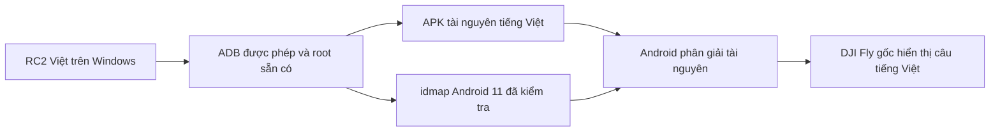

# RC2 Việt — Bộ công cụ DJI RC 2

Ứng dụng Windows kết nối DJI RC 2 qua USB để bật bản dịch tiếng Việt cho DJI Fly, cài Lawnchair và FreeFCC, đặt Lawnchair làm màn hình chính và mở chế độ nhà phát triển.

**Tên dự án:** RC2 Việt · **Repository:** `GinzaTech/rc2-viet` · **Bản bàn giao:** `v0.1.0`, ngày 06/10/2026.

EXE chứa Python runtime, ADB, các DLL ADB và bốn APK phục vụ chức năng. Người dùng EXE không cần cài Python, Android Studio hoặc ADB riêng. Driver USB, quyền USB debugging và quyền root sẵn có trên tay vẫn là điều kiện cần.

## Tải và bắt đầu

- [EXE đã build](https://github.com/GinzaTech/rc2-viet/releases/latest/download/RC2-TiengViet.exe).
- [Gói portable kèm tài liệu](https://github.com/GinzaTech/rc2-viet/releases/latest/download/RC2-TiengViet-Portable.zip).
- [Gói mã nguồn](https://github.com/GinzaTech/rc2-viet/releases/latest/download/RC2-TiengViet-Source.zip).
- [Trang Releases và toàn bộ tệp bàn giao](https://github.com/GinzaTech/rc2-viet/releases).
- [Mã SHA256 của các tệp](dist/SHA256SUMS.txt).

Nếu repository riêng tư, cần đăng nhập tài khoản GitHub có quyền truy cập để tải. Có thể tải EXE trực tiếp từ [thư mục dist](dist/RC2-TiengViet.exe) trong repository.

1. Bật RC 2, cắm vào PC bằng cáp USB truyền dữ liệu và mở `RC2-TiengViet.exe`.
2. Khi tay hiện **Allow USB debugging**, chọn **Allow**. Có thể tích **Always allow from this computer** để lưu máy tính này.
3. Nếu nhiều RC 2 được cắm, chọn đúng số sê-ri trong app.
4. Chờ trạng thái **Đã kết nối ADB với RC 2**. Tự động bật tiếng Việt chỉ thực hiện sau khi các kiểm tra tương thích đạt.
5. Trước khi cài ứng dụng hoặc thay đổi tài nguyên/Home, thực hiện khi không bay và giữ tay ở trang chủ DJI Fly hoặc Settings/Lawnchair.

Xem [hướng dẫn sử dụng và xử lý lỗi](docs/USAGE.md) nếu tay không kết nối hoặc không hiện hộp thoại Allow.

## Các chức năng đã làm

| Chức năng | Hành vi thực tế |
| --- | --- |
| Tự nhận RC 2 | Quét giao diện ADB bằng Windows SetupAPI, lấy số sê-ri từ thiết bị USB cha và kiểm tra WinUSB. |
| Ghép nối ADB | Cầu nối USB riêng gửi CNXN và khóa công khai của PC; người dùng vẫn phải xác nhận trên tay khi được hỏi. |
| Bật / cập nhật tiếng Việt | Kiểm tra đúng DJI Fly, cài RRO tài nguyên, tạo/kiểm tra idmap và đọc lại mẫu tiếng Việt. |
| Tắt bản dịch | Tắt RRO để Android dùng tài nguyên gốc của DJI Fly. |
| Cài Lawnchair | Cài APK 15 Beta 3 được nhúng, kiểm tra SHA256 và component mở ứng dụng. |
| Mở Lawnchair / DJI Fly | Gửi lệnh mở activity tương ứng tới RC 2 đã chọn. |
| Đặt Lawnchair làm màn hình chính | Cài cầu Home hỗ trợ Direct Boot và dùng đường định tuyến Home của firmware đã kiểm chứng. |
| Cài FreeFCC | Cài APK 1.5.5 được nhúng và đọc lại kết quả; không mở/kết nối app hay tự kích hoạt FCC. |
| Bật chế độ nhà phát triển | Hiện cảnh báo OK/Hủy, bật cờ Developer options, kích hoạt và mở màn hình Settings sẵn có. |
| Kết nối lại / lưu chẩn đoán | Làm mới phiên của công cụ và lưu các dòng tiến trình, không lưu khóa ADB hoặc dữ liệu tài khoản. |

Thanh điều hướng Android ba nút **chưa được bật**. Đã thấy mã thanh điều hướng trong SystemUI/framework lưu từ tay, nhưng phiên kiểm tra sau reset chưa lấy được shell; không đưa tính năng này vào bản bàn giao.

## Điều kiện và phạm vi tương thích

| Thành phần | Giá trị được kiểm tra |
| --- | --- |
| PC | Windows x64, driver WinUSB cho giao diện ADB sẵn có. |
| Tay | DJI RC 2, model `rc331`, Android 11 / SDK 30. |
| USB | VID/PID `2CA3:1021`, ADB interface 2, class/subclass/protocol `FF/42/01`. |
| Quyền | USB debugging đã bật; ADB được phép; shell root đã có trên firmware. |
| DJI Fly cho bản dịch | Package `dji.go.v5`, versionName `1.21.8`, versionCode `3115809`. |
| SHA256 DJI Fly gốc | `cfbf67368fa812c6e7d51430a07518ab47d056605bf373fcc69277e540caa32e`. |
| RRO hiện tại | `local.dji.fly.vietnamese`, `1.21.8-vi-reviewed5`, versionCode 7. |
| Home theo firmware | `services.jar` SHA256 `1372cd839fc8f495d4e166bd4f29e08a446ca7fcd4154bfa642174ca4e7352ed`. |

Công cụ không tạo quyền root, không unlock bootloader, không flash/downgrade firmware và không reset tay. Cài Lawnchair/FreeFCC kiểm tra riêng model, Android và root; điều kiện phiên bản/hash DJI Fly áp dụng cho Việt hóa và đặt Home theo firmware. Một RC 2 bất kỳ cùng chạy Android 11 chưa đủ để kết luận tương thích.

## Cách Việt hóa DJI Fly

### Cơ chế đang dùng

**APK DJI Fly gốc được giữ nguyên chữ ký DJI.** Bản đang bàn giao là một APK tài nguyên riêng theo cơ chế Runtime Resource Overlay (RRO), không phải DJI Fly đã ký lại.



Một RRO thay giá trị tài nguyên khi Android tra cứu tài nguyên của ứng dụng đích. Gói này khai báo `android:hasCode="false"`, không chứa DEX hoặc thư viện `.so`. Tham khảo [tài liệu RRO của Android](https://source.android.com/docs/core/runtime/rros).

Manifest chỉ tới `dji.go.v5` với targetName `DJIFlyLocalTranslation`. Nguồn XML hiện tại ở [translation/review-round2/overlay](translation/review-round2/overlay). Bốn nhóm cấu hình `values`, `values-en`, `values-en-rUS`, `values-vi` có dữ liệu tiếng Việt, nhằm khớp các cấu hình tài nguyên mà DJI Fly có thể đang dùng. Vì vậy bản này có thể hiển thị tiếng Việt ngay cả khi app vẫn chọn tiếng Anh; không có nghĩa đã thêm một lựa chọn ngôn ngữ chính thức vào menu DJI.

### Quy trình dịch và rà

1. Trích xuất các tài nguyên văn bản của đúng APK DJI Fly 1.21.8; phân biệt `strings`, `plurals`, `arrays` và nội dung kỹ thuật.
2. Tạo bản dịch nháp bằng mô hình dịch chạy cục bộ, sau đó rà câu đầy đủ thay vì ghép từng từ vào câu tiếng Anh.
3. Thống nhất thuật ngữ theo ngữ cảnh: ghi âm/ghi hình/nhật ký bay, màn trập, gimbal, cảm biến, RTH, radar và thông báo lỗi.
4. Giữ biến định dạng như `%1$s`, `%2$d`, số đo, mã lỗi, xuống dòng, thẻ và cấu trúc mảng/số nhiều. Giới hạn ngoại lệ theo đúng nhãn được yêu cầu.
5. Loại các dữ liệu kỹ thuật bị dịch nhầm, bổ sung câu còn tiếng Anh và áp dụng các sửa câu do người dùng yêu cầu.
6. Build APK RRO, ký bằng khóa riêng của gói này, kiểm tra không có mã thực thi và kiểm tra lại APK trên tay.

Số liệu của reviewed5: **11.923 mục được quét**, **11.148 mục tài nguyên hoạt động**, **4.133 mục thay đổi so với gói nền versionCode 3**, và **17 mục kỹ thuật được loại khỏi overlay**. Hai danh sách ứng viên bị từ chối/tài nguyên cần dịch còn chờ đều bằng 0 trong báo cáo bảng tài nguyên. Đây không phải chứng minh rằng mọi màn hình, cảnh báo của mọi máy bay, nội dung web/native đã được dịch và thử.

Một số câu đã sửa theo yêu cầu:

| Câu trước | Câu hiện tại |
| --- | --- |
| Hiển thị bản đồ rađa | Hiển thị bản đồ radar |
| quay về điểm đã đặt | quay về vị trí ban đầu |
| La bàn bình thường | La bàn hoạt động bình thường |
| Hệ mét(km) | Hệ kilomet(Km) |
| Điều chỉnh độ nhạy và đường cong đáp ứng | điều chỉnh độ nhạy và đường cong |
| Tinh chỉnh độ nhạy và đường cong đáp ứng của máy bay và gimbal | Tinh chỉnh độ nhạy và đường cong của máy bay và gimbal |
| Quay mượt | quay phim |
| Đường cong đáp ứng cần điều khiển | đường cong cần điều khiển |
| Tùy chọn bay vòng tránh | Tùy chọn tránh khi bay |

### Cài và ánh xạ trên RC 2

DJI Fly gốc trên tay đã thử không cho phép bật gói này như một overlay thông thường. Công cụ dùng root đã có để tạo idmap với chính sách public và tùy chọn bỏ kiểm tra overlayable, kéo idmap về PC, kiểm tra cấu trúc Android 11 v4, hai đường dẫn APK và chính sách, rồi đổi đúng byte tiêu đề 20 trước khi đưa cache trở lại tay.

Cache được đặt chủ sở hữu `root:system`, quyền `644` và phục hồi SELinux context. Công cụ bật overlay cho user 0 và đọc lại trạng thái/tài nguyên mẫu. Nếu bước kiểm tra thất bại, công cụ tắt overlay và thử phục hồi cache trước đó. Chi tiết và giới hạn ở [docs/VIETNAMESE.md](docs/VIETNAMESE.md), mã thực thi ở [activation.py](rc2vi/activation.py) và [core.py](rc2vi/core.py).

### Những cách đã thử nhưng không dùng

- Bản DJI Fly dịch trực tiếp rồi ký lại đã crash native; đã phục hồi APK DJI gốc trước khi chuyển sang RRO.
- Thử can thiệp Java bằng Frida cũng gây crash; bản bàn giao không sử dụng Frida.
- Chọn Home mặc định theo Android hoặc trỏ thẳng vào Lawnchair chỉ hoạt động chưa đầy đủ qua reboot trên firmware đã thử; cầu Direct Boot giải quyết nhánh đã quan sát.

Các APK DJI Fly thử nghiệm lớn nằm ngoài thư mục app Windows này không được đưa vào repository. Đủ **7 APK hiện có trong chính thư mục dự án app** được giữ và ghi mục đích trong [docs/APK_INVENTORY.json](docs/APK_INVENTORY.json).

## Lawnchair, Home và FreeFCC

### Lawnchair

Bấm **Cài Lawnchair** sau khi ADB kết nối. App dùng Lawnchair **15 Beta 3** (`app.lawnchair`, versionCode `1500020300`) từ [bản phát hành chính thức](https://github.com/LawnchairLauncher/lawnchair/releases/tag/v15.0.0-beta3.0). Nếu đúng APK đã cài, app chỉ đọc lại; APK khác không tự bị ghi đè. Bấm **Mở Lawnchair** để dùng.

Để bật máy vào launcher, bấm **Đặt Lawnchair làm màn hình chính**. App cài `local.rc2.home`, chọn cầu Home và đặt `persist.dji.fw.home` theo nhánh firmware đã đọc. Cầu hỗ trợ [Direct Boot](https://developer.android.com/privacy-and-security/direct-boot), chờ `UserManager.isUserUnlocked()` rồi mở Lawnchair. Cầu không yêu cầu Internet, root, vị trí, camera hoặc đọc tài khoản khi chạy. Đây là chức năng riêng, không tự thực hiện khi cài Lawnchair.

### FreeFCC

Bấm **Cài FreeFCC** để cài **1.5.5** (`com.freefcc.app`, versionCode 22) từ [bản phát hành chính thức](https://github.com/doesthings/FreeFCC/releases/tag/v1.5.5). APK được chuyển sang thư mục tạm, kiểm tra SHA256, cài bằng `pm install --user 0` và kiểm tra lại package/component; tránh cách cài streaming đã từng bị kẹt trên tay.

Cài xong, mở Lawnchair → vuốt lên danh sách ứng dụng → FreeFCC. Nút cài không mở app, không bấm Connect, không bật FCC/Auto-FCC/4G và không chứng minh đã đổi chế độ truyền sóng.

## Developer options và quyền USB

Nút **Bật chế độ nhà phát triển** hiện cảnh báo mỗi lần bấm. **Hủy** không gửi lệnh; **OK** mới bật cờ `development_settings_enabled`, kích hoạt activity Developer options có sẵn trong Settings và mở màn hình đó. Không sửa/ký lại APK Settings.

Nút cần ADB đã kết nối và root sẵn có; không bật được USB debugging từ PC khi tay không xuất giao diện ADB. Cảnh báo nhắc không tắt thủ công USB debugging hoặc Developer options: nếu không khôi phục được từ tay, có thể phải khôi phục cài đặt gốc, mất dữ liệu người dùng trong bộ nhớ trong. Chưa xác minh rằng mọi lần tắt đều bắt buộc reset.

Lần thử trước đã giữ khóa ghép nối của PC và đặt thời gian hết hạn quyền ADB bằng 0. Kết nối tự động không hiện hộp thoại qua mọi lần reboot **chưa được chứng minh**. Công cụ không tự cho phép mọi máy tính, không thay/xóa khóa host đang có và không tự bấm hộp thoại Allow.

## Toàn bộ APK và EXE trong repository

| Tệp | Vai trò | Có dùng để cài từ app? |
| --- | --- | --- |
| [assets/vietnamese-resources.apk](assets/vietnamese-resources.apk) | RRO tiếng Việt reviewed5. | Có |
| [assets/home-bridge.apk](assets/home-bridge.apk) | Cầu Home Direct Boot tự viết. | Có |
| [assets/lawnchair.apk](assets/lawnchair.apk) | Lawnchair 15 Beta 3 chính thức. | Có |
| [assets/freefcc.apk](assets/freefcc.apk) | FreeFCC 1.5.5 chính thức. | Có |
| [android-home/unsigned.apk](android-home/unsigned.apk) | APK build trung gian chưa ký. | Không |
| [android-home/aligned.apk](android-home/aligned.apk) | APK build trung gian đã zipalign, chưa ký. | Không |
| [artifacts/reference/dpad_systemui.apk](artifacts/reference/dpad_systemui.apk) | SystemUI gốc trích xuất để phân tích; không phải SystemUI mod. | Không |
| [dist/RC2-TiengViet.exe](dist/RC2-TiengViet.exe) | EXE Windows hoàn chỉnh. | Chạy trên PC |

Không cài SystemUI tham chiếu hoặc APK trung gian để thử thay thế hệ thống. Công cụ không có thao tác cài các tệp đó. Khóa ký `.jks`, mật khẩu ký, `adbkey`, dữ liệu DJI Fly/backup và môi trường `.venv` không nằm trong repository.

## Mã nguồn và build

```text
app.py                         GUI Windows và các chế độ CLI
rc2vi/                         USB/ADB, kiểm tra và các dịch vụ
assets/                        ADB/DLL, 4 APK dùng được và giấy phép
android-home/                  Java source/manifest/build của cầu Home
translation/                   XML bản dịch, bộ quy tắc và báo cáo rà
tests/                         Kiểm thử lõi, dịch vụ, worker và nút Tk
docs/                          Hướng dẫn, lịch sử, kiểm chứng và inventory
artifacts/reference/           APK SystemUI chỉ để phân tích
dist/                          EXE build và SHA256SUMS
```

Công nghệ: **Python 3.11**, **Tkinter/ttk**, **ctypes + Windows SetupAPI/WinUSB**, **ADB 37.0.0**, **PyInstaller 6.16.0**; cầu Home viết bằng **Java**, bản dịch dùng **Android XML/RRO**. Không dùng Electron hay trình duyệt làm giao diện app.

Build EXE từ nguồn trên Windows:

```powershell
git clone https://github.com/GinzaTech/rc2-viet.git
cd rc2-viet
py -3.11 -m venv .venv
.\.venv\Scripts\python.exe -m pip install --upgrade "pip>=26.2.1"
.\.venv\Scripts\python.exe -m pip install -r requirements-dev.txt
.\build.ps1
```

Build kiểm thử, coverage tối thiểu 80%, GUI smoke và đóng gói onefile/windowed. Kết quả ở `dist/RC2-TiengViet.exe`. Các APK đã có sẵn nên build EXE không cần khóa ký Android. Build lại APK riêng cần Android SDK/JDK và khóa riêng ở ngoài Git; xem [docs/BUILD.md](docs/BUILD.md). APK ký bằng khóa khác sẽ có SHA256 khác, các pin không được tự bỏ qua.

Các lệnh CLI đã có:

```powershell
.\dist\RC2-TiengViet.exe --scan --report "$env:TEMP\rc2-scan.json"
.\dist\RC2-TiengViet.exe --verify-once --report "$env:TEMP\rc2-verify.json"
.\dist\RC2-TiengViet.exe --enable-dev-mode --report "$env:TEMP\rc2-developer.json"
.\dist\RC2-TiengViet.exe --gui-smoke
```

`--scan` chỉ đọc danh sách USB. `--verify-once` có thể cài/bật dịch, không phải lệnh chỉ đọc trong mọi trường hợp. `--enable-dev-mode` thực hiện chức năng không giao diện khi ADB đã được phép. Cài Lawnchair/FreeFCC hiện thực hiện bằng nút GUI.

## Kiểm chứng và những gì còn chưa hoàn tất

- Bộ kiểm thử Windows: **88 test đạt**, coverage **94,52%** cho các mô-đun lõi/dịch vụ được đo. Không coi đây là coverage của toàn bộ GUI hoặc driver WinUSB.
- EXE khởi động được; ADB nhúng chạy với Android SDK bị loại khỏi `PATH`; các APK trong EXE khớp pin SHA256; 10 nút vừa cửa sổ tối thiểu 760×660.
- Trước reset, bản dịch từng được cài/đọc lại, giữ qua reboot; Lawnchair từng mở và làm Home sau reboot; FreeFCC từng được cài/mở; Developer options từng mở được.
- Cài bằng hai nút mới trên chính tay sau reset chưa được kiểm chứng. Phiên ADB gần nhất vẫn có trường hợp offline/không hiện Allow; chưa kết luận khắc phục vĩnh viễn.
- Chưa thử bay, chưa chứng minh độ ổn định trong mọi tình huống bay, chưa thử firmware/máy bay khác, chưa bật thanh điều hướng ba nút và chưa kích hoạt FCC bằng công cụ.

Xem [docs/VERIFICATION.md](docs/VERIFICATION.md). Bản ghi lịch sử đã che số sê-ri và đường dẫn cá nhân trong [docs/historical-evidence.json](docs/historical-evidence.json).

## Dự án gốc và ghi công

| Dự án | Mã nguồn / tài liệu | Bản được dùng |
| --- | --- | --- |
| FreeFCC | [doesthings/FreeFCC](https://github.com/doesthings/FreeFCC) · [Website](https://freefcc.pages.dev/) | [v1.5.5](https://github.com/doesthings/FreeFCC/tree/v1.5.5) |
| Lawnchair | [LawnchairLauncher/lawnchair](https://github.com/LawnchairLauncher/lawnchair) | [v15.0.0-beta3.0](https://github.com/LawnchairLauncher/lawnchair/tree/v15.0.0-beta3.0) |
| Android Platform Tools / ADB | [Google Android SDK Platform Tools](https://developer.android.com/tools/releases/platform-tools) | 37.0.0, protocol 1.0.41 |
| Android RRO | [AOSP RRO](https://source.android.com/docs/core/runtime/rros) | Cơ chế tài nguyên |
| PyInstaller | [PyInstaller](https://pyinstaller.org/) | 6.16.0 |
| DJI Fly / RC 2 | [DJI Fly](https://www.dji.com/downloads/djiapp/dji-fly) · [DJI RC 2](https://www.dji.com/rc-2) | Mục tiêu thử nghiệm; không phải đối tác dự án |

RC2 Việt không phải sản phẩm chính thức của DJI, Lawnchair hoặc FreeFCC. APK bên thứ ba giữ nguyên chữ ký/giấy phép của tác giả; mã nguồn RC2 Việt không thay quyền sở hữu các thành phần đó. Xem [THIRD_PARTY_NOTICES.md](THIRD_PARTY_NOTICES.md).
