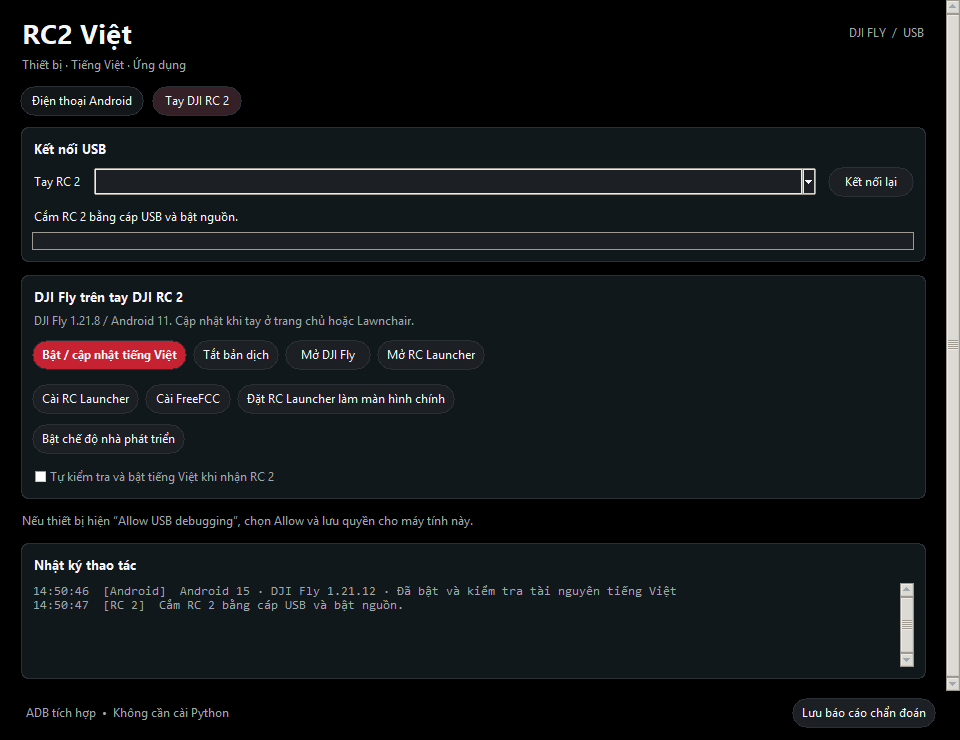

# RC2 Việt — công cụ Windows và launcher cho DJI RC 2

**Bản 0.8.0 dựng tiếng Việt từ chính APK đích.** Cả RC 2 và điện thoại đều dùng một luồng: tự lấy APK → kiểm tra toàn bộ tài nguyên → so sánh các nguồn bản dịch đã rà → dịch bổ sung bằng CPU trên PC → kiểm tra cấu trúc/placeholder → dựng, ký và cài RRO riêng. Không yêu cầu gói Việt hóa dựng sẵn hoặc một catalog cụ thể; khi không có bộ nhớ dịch, các mục cần dịch đi qua engine.

Bộ nhớ là tham khảo tùy chọn và chỉ được tái dùng khi nguồn/contract phù hợp. Engine hỗ trợ nguồn Anh và Trung sang Việt. Tài nguyên kỹ thuật, mã, URL và tham chiếu được giữ nguyên. App chỉ đưa gói vào thiết bị khi không còn mục đủ điều kiện bị bỏ dở; lỗi model/contract tạo báo cáo và dừng trước cài. “Hoàn chỉnh” ở đây là đủ tài nguyên và hợp lệ cấu trúc, không phải cam kết mọi câu dịch máy đã được con người duyệt.

EXE tự lấy engine công khai về PC ở lần dùng đầu, kiểm tra từng hash rồi chạy cục bộ. Nội dung APK không gửi tới dịch vụ dịch online, không cần API key/Python/SDK. **Portable ZIP có sẵn engine để dùng ngoại tuyến**; giữ thư mục `translation-engine` cạnh EXE. Giữ yêu cầu nền tảng hiện có: RC 2 Android11/root hoặc điện thoại Android15/root. [Chi tiết cơ chế](docs/VIETNAMESE.md).

Phạm vi thay đổi là **Việt hóa**. Patch mã menu/HUD vẫn dùng profile tương thích riêng. Theo yêu cầu người dùng, bản cập nhật được kiểm chứng cục bộ; không kiểm tra/cài trên thiết bị ở lượt này.

Bản cục bộ **0.8.0**, ngày 10/10/2026, có nút **Cài / cập nhật menu** tự lấy APK DJI Fly từ RC 2, patch, ký và cài lại. Bạn không cần chọn file APK. Menu trên tay dùng các hàng điều khiển gọn trên nền tối; LED Trước/Sau bật-tắt riêng sau mỗi lần bấm và đọc trạng thái thực khi mở. App Windows giữ hai trang riêng **Điện thoại Android** / **Tay DJI RC 2**, launcher mặc định **RC Launcher**. Kết quả thiết bị và các phần chưa xác minh nằm trong [hướng dẫn HUD](docs/HUD_APK.md).

Bấm **Cài / cập nhật menu** trong tab RC 2 khi đã kết nối ADB và tay ở trang chủ/Launcher. App lấy đúng APK đang cài trên tay và kiểm tra hash/phiên bản/serial. Nếu là bản HUD/menu đã kiểm chứng, template nhỏ1,6MB tái tạo đúng nguồn gốc1.21.8 từ phần dữ liệu nén được giữ nguyên; không cần file gốc hoặc cache từ PC khác. Java, Python, ADB và công cụ APK đã nhúng; toàn bộ APK Fly468MB và khóa riêng không nhúng. Nguồn khác phiên bản hoặc mod không được hỗ trợ bị từ chối trước cài.

Luồng một nút: lấy APK từ tay → phục hồi nguồn đã pin nếu cần → patch menu/HUD → căn chỉnh/ký → kiểm chứng → cài đúng APK mới. Cùng chữ ký cập nhật giữ dữ liệu; khác chữ ký vẫn yêu cầu xác nhận sao lưu và gỡ/cài. Phần menu chỉ có nút **Cài / cập nhật menu**; đã bỏ hàng Nâng cao và các nút thao tác APK thủ công. App dùng lại ADB thường đã sẵn sàng thay vì mở thêm phiên USB. Bản 0.8.0 được cập nhật trực tiếp trong repository; các gói ở GitHub Releases vẫn là bản phát hành trước đó.

Chạm nhanh hai lần gần cùng vị trí trong preview để ẩn HUD; chạm hai lần tiếp để hiện lại. Menu RC lưu lựa chọn cử chỉ. LED chỉ điều khiển trong menu trang chủ: bấm Trước hoặc Sau đảo trạng thái nhóm đó, giữ nguyên nhóm còn lại; Bật hết/Tắt hết điều khiển cả hai nhóm. Mở menu hiện đang đọc/chưa xác định và khóa LED đến khi GET thành công; không suy ra tắt từ dữ liệu thiếu. Trạng thái và màu chỉ theo dữ liệu đọc thực. Sau gồm rear/status; bật một phần được hiển thị “Một phần” và bấm sẽ tắt cả nhóm sau. Bộ xử lý yêu cầu máy bay còn kết nối, đã hạ cánh/động cơ dừng, dùng SDK của Fly, giữ bit ngoài nhóm đã chọn, ghi một lần và đọc lại. Lỗi/timeout không báo thành công. Kết quả vật lý bản cũ được lưu riêng; bản toggle mới cần kiểm tra riêng trên tay. Đường socket LED DUML trực tiếp của bản0.4 đã loại khỏi runtime.

Mục **FCC / vùng gốc** dùng SDK stock trong APK mod, không cài/mở FreeFCC. FCC dùng setForceFcc và GET mới đối chiếu override; khôi phục chỉ dùng giá trị ban đầu đã quan sát trong phiên, gắn với máy bay, không đoán CE. Đã đọc override2 và quan sát biểu đồ phù hợp chỉ báo FCC; công suất RF, duy trì và khôi phục vẫn cần kiểm chứng riêng. Chưa có keepalive. **Xuất hình** lưu lựa chọn Có HUD / Không HUD và báo đúng trạng thái màn ngoài; driver DP-1 tồn tại trên tay đang thử nhưng tín hiệu USB-C/HDMI vật lý chưa xác minh. Không HUD dùng riêng preview với SurfaceControl mirror hoặc fallback PixelCopy tối đa5fps; không thay bằng xuất qua PC.



## Tải và dùng

Tệp cục bộ0.8.0 ở `dist/RC2-TiengViet.exe` và `dist/RC2-TiengViet-Portable.zip`; metadata ở [dist/release-verification.json](dist/release-verification.json). Các liên kết GitHub dưới đây vẫn trỏ tới bản đã phát hành trước đó.

**EXE 0.8.0 mới nhất trong repository:** [Tải RC2-TiengViet.exe](https://github.com/GinzaTech/rc2-viet/raw/refs/heads/codex/initial-release/dist/RC2-TiengViet.exe). Đối chiếu SHA256 với [checksum hiện tại](dist/SHA256SUMS.txt). Trường `github_published=false` trong metadata của build nói về gói GitHub Release riêng; bản cập nhật Git này không tạo Release/tag mới.

- [RC2-TiengViet.exe](https://github.com/GinzaTech/rc2-viet/releases/latest/download/RC2-TiengViet.exe): Windows x64, Python runtime/ADB/DLL và APK đã nhúng.
- [Portable ZIP kèm hướng dẫn](https://github.com/GinzaTech/rc2-viet/releases/latest/download/RC2-TiengViet-Portable.zip).
- [Source ZIP](https://github.com/GinzaTech/rc2-viet/releases/latest/download/RC2-TiengViet-Source.zip).
- [Releases và APK riêng](https://github.com/GinzaTech/rc2-viet/releases).
- [SHA256SUMS](dist/SHA256SUMS.txt).

1. Bật tay/điện thoại, nối USB dữ liệu, mở EXE. Không cần cài Python hoặc ADB; Windows vẫn phải có driver ADB/WinUSB phù hợp.
2. Bấm Allow USB debugging trên thiết bị nếu được hỏi; chọn đúng trang và sê-ri. Công cụ không tự bỏ qua xác nhận này.
3. Với RC: bấm **Cài RC Launcher**, **Mở RC Launcher**, rồi **Đặt RC Launcher làm màn hình chính** khi không bay và tay ở launcher/trang chủ/Settings.
4. **Bật / cập nhật tiếng Việt** áp dụng đúng gói theo platform/SDK/APK hash. **Tắt bản dịch** phục hồi tài nguyên gốc; không xóa DJI Fly/tài khoản.
5. Với điện thoại: **Kiểm tra tương thích** trước khi bật dịch. Điện thoại yêu cầu Android15 có root; phiên bản DJI Fly không bị khóa. Không tự root điện thoại.
6. Có nút cài FreeFCC và mở Developer options. Cài FreeFCC không tự kích hoạt FCC. Cảnh báo trước Developer options nói rõ nguy cơ mất ADB nếu tắt thủ công.
7. Muốn cài menu/HUD: chọn trang **Tay DJI RC 2**, bấm **Cài / cập nhật menu** khi tay đã kết nối ADB, máy bay đã tắt/hạ cánh và tay ở trang chủ/Launcher. App tự lấy APK, patch, ký và cài; không cần chọn file. Nếu khác chữ ký, app kiểm tra sao lưu rồi hỏi đồng ý gỡ/cài; thao tác này có thể mất đăng nhập và khóa Keystore. Giữ cáp/nguồn đến khi có kết quả.

[Hướng dẫn](docs/USAGE.md) · [Android](docs/ANDROID_PHONE.md) · [RC Launcher/Home](docs/RC_LAUNCHER.md) · [Việt hóa](docs/VIETNAMESE.md) · [Build](docs/BUILD.md).

## RC Launcher mới

Source: [GinzaTech/rc-launcher](https://github.com/GinzaTech/rc-launcher), adaptation của Lawnchair/Launcher3, package riêng dev.rclauncher.rc2.debug. Icon trên dashboard lấy từ ứng dụng đã cài/chọn, không phải bộ glyph giả. Chạm mở đúng app, giữ để ghim. Menu ⋮ vào danh sách/cài đặt. Thanh trên hiển thị pinRC/Wi-Fi và **CPU / Pin** riêng.

CPU được đọc từ sensor cpuss/sysfs nếu app có quyền đọc; Pin là giá trị Android/driver pin báo. Đã thấy CPU khoảng87–95°C trong kernel trong khi pin báo30°C; chưa xác minh hiệu chuẩn firmware và không đo nhiệt độ vỏ. Không coi30°C là nhiệt độ toàn bộ tay hay chứng nhận không nóng.

Cầu Home3.0 ưu tiên RC Launcher debug, sau đó release; Lawnchair cũ chỉ là fallback nếu launcher mới không mở được. Đã kiểm tra Home từ Settings và sau reboot trên RC331/V14.00.00.04 test-keys, API30. Công cụ kiểm tra services.jar và APK trước khi đổi đường Home; không flash/sửa framework. Không gỡ Lawnchair tự động để giữ đường khôi phục.

## Gói nhúng

| Tệp | Vai trò / bản |
| --- | --- |
| rc-launcher.apk | RC Launcher mới, APK debug đã ký; version/hash trong manifest báo cáo phát hành |
| home-bridge.apk | Home3.0, đưa boot/Home vào launcher mới, có fallback |
| vietnamese-resources.apk | RRO RC Fly1.21.8, reviewed6/code8; Hệ thống cảm biến đã sửa |
| phone-vietnamese-resources.apk | RRO điện thoại Fly1.21.12-vi3; nguồn/hash riêng |
| freefcc.apk | FreeFCC1.5.5, tiện ích ngoài; chỉ cài/mở theo người dùng |
| lawnchair.apk | Lawnchair15 Beta3 upstream, chỉ giữ cho dự phòng/khôi phục |
| adb/ | Platform-tools nhúng + DLL, không phải driver tự cài |
| hud/ | Java runtime tối thiểu, APKtool/apksigner/zipalign, helper patch/ký, DEX HUD và helper khôi phục UID; toàn bộ có hash kiểm tra |

APK debug launcher cài được. APK release unsigned của repo launcher phải ký trước khi cài; không nhúng bản unsigned vào EXE. Các APK intermediate và SystemUI reference trong artifacts/reference không dùng để cài hệ thống.

## Việt hóa DJI Fly

Chức năng **Bật / cập nhật tiếng Việt** cài một runtime resource overlay riêng, ánh xạ chuỗi/plural/array, giữ APK/chữ ký/mã thực thi của Fly. RC dùng idmapv4/Android11; điện thoại dùng idmapv9/Android15. Mỗi profile kiểm tra phiên bản/code/hash, root, foreground và schema/path trước khi áp dụng; lỗi có rollback cache. Chức năng HUD riêng có sửa mã khởi động/manifest và ký lại APK Fly; gói do EXE tạo chỉ được dùng với tiếng Việt sau khi xác minh lại receipt và toàn bộ recipe.

Từ0.8.0, mọi phiên bản đi qua bộ dựng từ APK đích, kể cả1.21.8RC và1.21.12Android; không còn đường nhanh cài gói dịch đã pin. Bộ nhớ được so khớp, phần thiếu được engine dịch bổ sung trước khi kiểm tra và cài. Chi tiết và hash ở docs/VIETNAMESE.md, docs/ANDROID_PHONE.md.

Không dịch HTML/server hoặc chữ nằm trong ảnh bằng RRO. Đây là bản dịch đã rà và kiểm chứng một số màn hình, không tuyên bố100% UI/độ ổn định bay. Phone vi2 đã quan sát; vi3 có trong EXE để cập nhật, chưa áp dụng dòng mới trên điện thoại sau khi người dùng chuyển cáp sang RC.

## Kiểm chứng và giới hạn

Bản menu toggle0.6.1 đạt834tests source, coveragePython89,11%, gồm49ca tương tác trên DeviceMenu production bằng JVM fixtures. EXE đã build; kiểm tra frozen và kết quả đóng gói được ghi trong báo cáo. Cài và đánh giá hình thức/bấm LED trên RC2 của bản mới chỉ được đánh dấu đạt sau khi ADB có Allow và được kiểm tra riêng; không dùng kết quả menu0.6.0 để xác nhận toggle0.6.1.

Lượt cập nhật menu/EXE mới đạt777tests toàn bộ source với coveragePython89,11%; sau thay đổi probe cuối có38checks Android/lifecycle/payload và15tests đóng gói đạt. EXE tự tạo APK khi PATH chỉ cóSystem32, không JAVA_HOME/CLASSPATH; đầu ra khớp source. Worker một nút đã dựng/ký/cài trên RC2 thật; cập nhật cùng signer giữ dữ liệu vàUID10029. Menu hai cột hiện đủ mục trên tay; các nút LED có ACK và GET mới đúng Trước233, Sau206, Cả hai239, Tắt hết200. Người dùng đã xác nhận vật lý all-off trước/sau ổn định ở bản thử riêng.

Xuất hình vật lý vẫn chưa xác minh: driverDP-1 có nhưng chưa gắn adapter/màn hình; probe riêng của mirror và PixelCopy nhậnbufferđen, chưa chứng minh hình sạch. FCC có override2 và chỉ báoUI, chưa đo công suất/duy trì; khôi phục vùng gốc cần baseline phù hợp trong phiên. Các kết quả588tests/LED-9/FCC thiếuACK ở đầu bản0.6 là snapshot cũ, giữ nguyên trong [báo cáo theo từng bản](docs/hud-installation-2026-10-09.json); không dùng chúng mô tả bản mới và không coi hosttests là bằng chứng toàn bộ phần cứng đạt.

- PC có unit/integration guards, nút Tk thật, layout ở cửa sổ nhỏ và EXE smoke. Lượt0.4.0 đạt547 kiểm thử source/coverage Python93,87% và15 kiểm thử đóng gói. Có JVM tests nhận chạm/frame/TCP/hủy và kiểm tra DEX nhúng khớp source; coverage Python không bao gồm UI Android. [Kết quả0.3.0](docs/hud-pipeline-verification.json) được giữ như bằng chứng lịch sử.
- HUD 0.3.0: đã tạo APK thật từ EXE bằng Java nhúng, kiểm tra chữ ký v3 cho API30, recipe, tài nguyên/native và dữ liệu nén được giữ nguyên. Bản APK này chưa được mở/reboot trên RC vì không có tay kết nối khi kiểm tra; kết quả cài/reboot bản HUD thủ công trước đó là bằng chứng riêng. Installer mới được kiểm tra bằng fake ADB trên PC, chưa kiểm chứng trực tiếp trên tay.
- RC: cài/mở launcher, chọn/mở Fly, icon app thật, tìm kiếm, pin/Wi-Fi/CPU-Pin; Home vào RC Launcher và boot đã quan sát.
- Global navigation optional/off. User đang dùng native Android3bar; không tuyên bố service/Recents/gesture toàn hệ thống đã test.
- Chưa thử bay, soak dài, benchmark release đầy đủ hoặc mọi firmware. Giữ đúng SDK/hash được pin; không thay pin để ép tương thích.
- ADB offline của firmware không được vô hiệu hóa vĩnh viễn; cầu WinUSB có thể cần người dùng Allow sau kết nối/reboot.

## Build

Windows, Python3.11 và JDK17 cho kiểm thử Java Home. Build EXE dùng toolchain HUD/APK đã có; muốn dựng lại toolchain cần JDK17, APKtool và Android build-tools. Khóa ký được tạo/lưu riêng theo tài khoản Windows khi chạy HUD; không đóng gói hoặc commit khóa.

```powershell
py -3.11 -m venv .venv
.\.venv\Scripts\python.exe -m pip install --upgrade pip
.\.venv\Scripts\python.exe -m pip install -r requirements-dev.txt
.\build.ps1
```

Keys/.env/adbkey/phone-work/backups/cache không có trong Git/source ZIP. Xem docs/BUILD.md để build RRO/Home bằng khóa riêng ngoài repo và nguồn đã kiểm chứng.

## Nguồn và ghi công

- [RC Launcher source](https://github.com/GinzaTech/rc-launcher), [Lawnchair upstream](https://github.com/LawnchairLauncher/lawnchair), base78873fa3a8872eaee3e10211174cb5338c021a4f.
- [Lawnchair15 Beta3](https://github.com/LawnchairLauncher/lawnchair/releases/tag/v15.0.0-beta3.0), Apache2.0.
- [FreeFCC](https://github.com/doesthings/FreeFCC), [v1.5.5](https://github.com/doesthings/FreeFCC/releases/tag/v1.5.5), [website](https://freefcc.pages.dev/).
- [DJI Fly chính thức](https://www.dji.com/downloads/djiapp/dji-fly).

Dự án độc lập, không phải ứng dụng chính thức của DJI/Lawnchair. Giữ LICENSE/THIRD_PARTY_NOTICES.md và license của từng gói.
